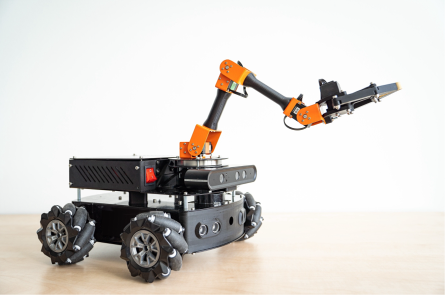

# MIRTE Master Robot - SINDYc & Tube NMPC

*Figure 1: MIRTE Master robot [1]*

This repository contains code for modelling and robust trajectory tracking of the MIRTE Master omnidirectional robot. Modelling is performed with **SINDYc** (sparse identification of nonlinear dynamics with control), and control uses **tube-based nonlinear model predictive control (NMPC)** with a **discrete linear-quadratic regulator (DLQR)** ancillary law.

---

## Repository structure

- `A-MATLAB/`
  - SINDYc model identification.
  - Tube-based NMPC simulation using `fmincon`.
- `B-Tube-NMPC_Deployment/`
  - Real-time controller for the MIRTE Master robot.
  - Provides a simulated model with fictitious disturbances for offline evaluation.
  - Contains a baseline NMPC controller for comparison.
	
Each directory includes its own `README.md` and implementation details.

---

## Demonstration videos

Two short clips show tube-based NMPC tracking with constant heading on different paths: https://elbon1.github.io/mirte-master-tube_nmpc/

<!-- ### Rectangular path

<video controls width="720" style="max-width:100%">
  <source src="https://github.com/elbon1/mirte-master-tube_nmpc/releases/download/v0.1.0/rectangular_path.mp4?raw=1" type="video/mp4">
</video>

### Circular path

<video controls width="720" style="max-width:100%">
  <source src="https://github.com/elbon1/mirte-master-tube_nmpc/releases/download/v0.1.0/circular_path.mp4?raw=1" type="video/mp4">
</video> -->

---

## References

[1] Martin Klomp, Khaldon Araffa, and Gillian Saunders-Smits. MIRTE: an affordable, open, mobile robot education platform. In: (2024). Publisher: Zenodo. DOI: 10.5281/ZENODO.14256821.

